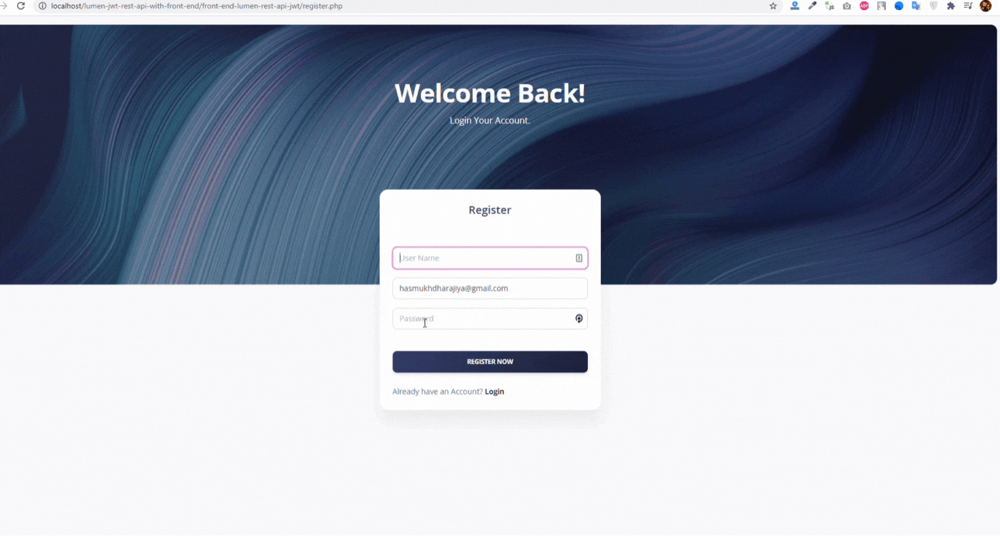

## lumen-jwt-rest-api-with-front-end
Complete REST API with Lumen 8.x(with JWT) and Frontend integration Mini Project.Lumen is a PHP micro-framework built to deliver microservices and fast APIs.
Building a robust restful API in Lumen using JWT Authentication. Frontend Project using JQuery and Ajax.

## How to use

1. Clone the repository with following path `C:\xampp\htdocs`
2. git clone `git clone https://github.com/hasmukh-dharajiya/lumen-jwt-rest-api-with-front-end.git`
3. Open `lumen-jwt-rest-api-with-front-end/lumen_jwt_rest_api` 
4. Copy `.env.example file to .env`
5. Edit database credentials in .env file `DB_DATABASE=dashboard`
6. Run `composer install`
7. Run `php artisan jwt:secret`
8. Run `php artisan migrate`
9. Run `php -S localhost:8000 -t public`

`Note`: Replace Code Following path **'vendor/laravel/lumen-freamework/config/auth.php**':

```
<?php
return [
    'defaults' => [
        'guard' => env('AUTH_GUARD', 'api'),
        'passwords' => 'users',
    ],
   
    'guards' => [
        'web' => [
            'driver' => 'session',
            'provider' => 'users',
        ],

        'api' => [
            'driver' => 'jwt',
            'provider' => 'users',
            'hash' => false,
        ],
    ],
    'providers' => [
        'users' => [
            'driver' => 'eloquent',
            'model'  =>  App\Models\User::class,
        ]
    ],
    
    'passwords' => [
        //
    ],

];

```
10. Open xampp and Start Apache Server
11. Run **login.php** in lumen-jwt-rest-api-with-front-end/front-end-lumen-rest-api-jwt Folder `http://localhost/lumen-jwt-rest-api-with-front-end/front-end-lumen-rest-api-jwt/register.php`

All Set First Register With Email and Password. 

`Note`: Make Sure Lumen Project Run In Background (Testing: http://localhost:8000/).

## Feature
Key Feature of Project.

- Backend API using Lumen with JWT Authentication.
- Real World Calling Api with Front End Dashboard
- Custom Authentication System (without jetstream)
- Register,Login And Dashboard Design
- Run Local Environment
- Responsive Template
- Use Real-World Project
- Authorized User Using JWT Token.
- Front End Project Call Lumen Api using AJAX.

## Login View
`http://localhost/lumen-jwt-rest-api-with-front-end/front-end-lumen-rest-api-jwt/login.php`



## Dashboard View
`http://localhost/lumen-jwt-rest-api-with-front-end/front-end-lumen-rest-api-jwt/user/index.php`


